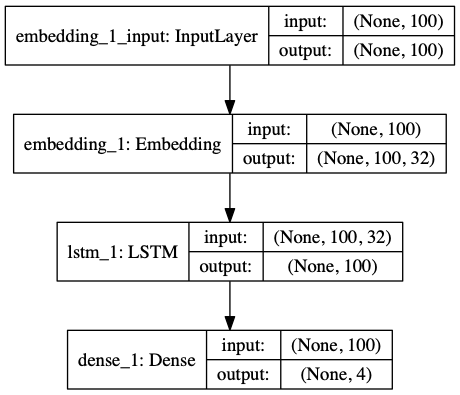

# WeightliftingApp ML Model
A series of programs written in Python using the [Rotoworld](http://www.rotoworld.com/sports/nba/basketball?ls=roto:nba:gnav) mobile API to train a [Keras](https://keras.io) deep learning model for the purpose of evaluating NBA players based on tokenized news articles.

### NBA player news article training _input_ example:

Here is a snippet of the original article:

``` "Hassan Whiteside scores 17 points in loss: He was invisible in the first half..." ```

In the first step, we clean the article, replacing names and numbers with generic tokens to avoid confusing the algorithm. We do not worry about punctuation or capitalization as it is automatically removed during tokenization.

``` "NAME scores points in loss: He was invisible in the first half..." ```

During training, we look at a large batch of sample articles (1000+) and use them to determine the most used words. By trimming this list down to the top 1000 tokens, we have a better chance of assigning meaning to these words while avoiding extraneous words that we may not have enough data on. These words, for example ```invisible```, are replaced with 0 and ignored by the training system. Finally, in order to feed our model the same sized data every time, we pad the sequences to a length of 100, adding ```0``` if the article is too short or trimming the article if it is longer than 100 words.

| name | scores | points | in | loss | he | was | invisible | in | the | first | half | ... |
| :---: | :---: | :---: | :---: | :---: | :---: | :---: | :---: | :---: | :---: | :---: | :---: | :---: |
| 1 | 33 | 20 | 3 | 178 | 7 | 22 | 0 | 3 | 2 | 65 | 224 | ... |

### Categorical _expected_ output example:

``` "+" ``` becomes ``` [ 0 0 1 0 ] ``` :

| + (positive) | - (negative) | 0 (neutral) | ! (injury) |
| :---: | :---: | :---: | :---: |
| 0 | 0 | 1 | 0 |
<pre>
      ||||||||
      ||||||||
      ||||||||
  Processed by model
    \\\\\\//////
      \\\\////
        \\//
</pre>
### Categorical _actual_ output example:

``` [ .067 .126 .807 .000 ] ``` becomes ``` "+" ``` :

| + (positive) | - (negative) | 0 (neutral) | ! (injury) |
| :---: | :---: | :---: | :---: |
| .067 | .126 | .807 | .000 |

### Current accuracy (500 training points @ 1,000 epochs, categorical crossentropy):
 - Training data: 100.0% :thumbsup:
 - Test data: 58.0% :disappointed:

### Current model

